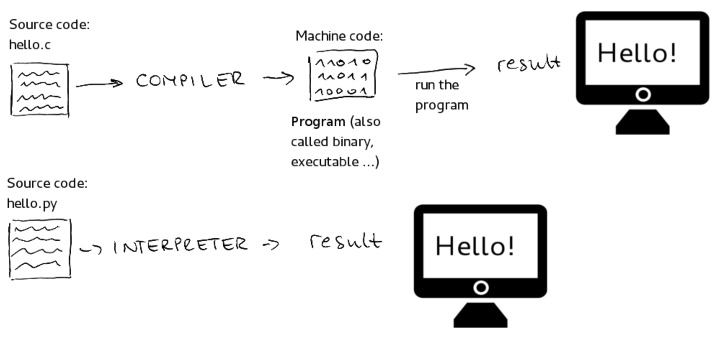

# 컴파일과 트랜스파일에 대해 설명헤주세요

컴파일과 트랜스파일은 **코드를 변환하는 프로세스**를 나타낸다.

컴파일은 **한 언어로 작성된 소스 코드를 다른 언어로 변환**하는 것을 의미한다.

- C → Assembly
- Java → bytecode

트랜스파일은 **소스 코드를 비슷한 수준의 추상화를 가진 다른 언어로 변환**하는 것을 의미한다.

- C++ → C
- ES6 → ES5 (Babel)
- typescript/coffeescript → Javascript
- sass/scss → css

## 인터프리터

사람이 알아보기 쉬운 프로그래밍 언어로 작성한 코드를 **한 줄씩 즉시 기계어로 변환**한다.

`print('hello')`를 작성하면 엔터를 누르는 순간 컴퓨터 언어로 변역된다.

번역 속도가 빠르지만 프로그램을 매번 실행하기에는 느리다.

## 컴파일러 vs 인터프리터

인간이 읽기 편한 고수준의 언어를 컴퓨터가 읽을 수 있게 저수준의 기계어로 변환하는 대표적인 방식이다.

컴파일러는 **프로그램 전체를 스캔하여 이를 모두 기계어로 변역**한다.

전체를 스캔하기에 보통 컴파일러는 초기 스캔 시간이 오래 걸린다.
하지만 **전체 실행 시간**만 비교하면 인터프리터보다 빠르다.

컴파일러는 전체 코드를 검사한 후 오류 메시지를 생성한다.
그래서 프로그램을 실행하기 전에 오류를 발견할 수 있다.

대표적 언어는 C,C++,JAVA이다.

 

인터프리터는 **프로그램 실행시 한 번에 한 문장씩 번역**한다.

한번에 전체를 스캔하고 실행 파일을 만들어 실행하는 컴파일러보다 실행시간이 더 걸린다.
하지만 컴파일러보다 **메모리 효율**이 좋다.

인터프리터는 한 문장씩 번역될 때 오류를 만나게 되면 바로 프로그램이 중지된다.

대표적 언어는 Python, Ruby, Javascript이다.

## 내용

## GPT로 문장 정리하기

> 컴파일과 트랜스파일에 대해 설명해줘

- 두 용어는 코드를 변환하는 프로세스
- 컴파일
  - 원시 코드를 기계어 또는 중간 코드로 변환
  - 주로 정적 언어에서 사용, 컴파일 시간에 코드의 오류 확인
  - 컴파일된 코드는 실행 속도가 빠르고 일반적으로 원시 코드를 직접 실행할 수 없음
  - C, C++, Java
- 트랜스파일
  - 소스 코드를 다른 언어로 변역
  - 고수준에서 다른 고수준 언어로 변환, 소스 코드를 읽어들이고 해당 코드를 비슷한 추상화 수준의 다른 언어로 변환
  - 주로 동적 언어에서 사용
  - TypeScript는 JavaScript로 트랜스파일된 프로그래밍 언어

## 키워드 정리

- 인터프리터

## 참고 자료

- [🖥️ 컴파일 / 트랜스파일 / 인터프리터 비교 쉽게 설명](https://inpa.tistory.com/entry/CS-%F0%9F%96%A5%EF%B8%8F-%EC%BB%B4%ED%8C%8C%EC%9D%BC-%ED%8A%B8%EB%9E%9C%EC%8A%A4%ED%8C%8C%EC%9D%BC-%EC%9D%B8%ED%84%B0%ED%94%84%EB%A6%AC%ED%84%B0-%EB%B9%84%EA%B5%90-%EC%89%BD%EA%B2%8C-%EC%84%A4%EB%AA%85)
