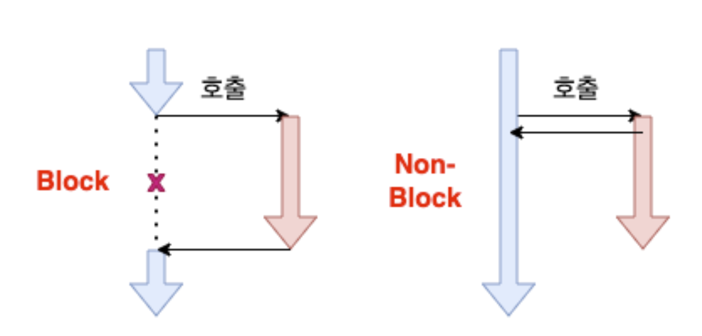
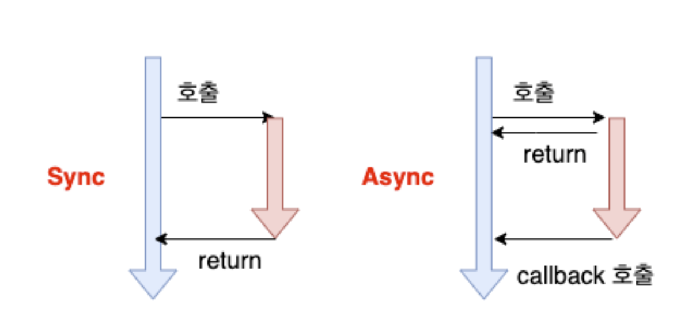

# 동기, 비동기에 대해 설명해주세요

비동기 처리는 **프로세스의 완료를 기다리지 않고 동시에 다른 작업을 처리하는 방식**이다.

## Blocking, Non-Blocking과 같이 이해하기

제어할 수 없는 대상의 처리 방법에 대해 이야기한다.

다른 주체가 작업할 때 자신의 **제어권**이 있는지 없는지로 볼 수 있다.

제어권이란 **함수를 실행할 권리**를 의미한다.

### Blocking

- 피호출자가 함수를 끝까지 실행
- 이후에 제어권을 호출자에게 돌려줌

자신의 작업을 진행하다가 다른 주체의 작업이 시작되면 다른 작업이 끝날 때까지 기다렸다가 자신의 작업을 시작한다.

### Non-Blocking

- 피호출자가 호출자에게 제어권을 바로 돌려줌

다른 주체의 작업에 관련없이 자신의 작업을 시작한다.

피호출자가 제어권을 잃어버렸는데 어떻게 태스크를 수행할 수 있을까?

이를 위해 **멀티 스레드 또는 콜백 함수**가 존재한다.

멀티 스레드 환경인 리눅스 I/O 환경에서 사용자 스레드가 시스템 콜로 요청을 보내면 커널 스레드가 생성되어 태스크가 수행되고 사용자 스레드가 보내준 제어권은 바로 다시 돌려준다.
스레드가 두 개가 되어 각각 제어권을 가지고 함수를 수행할 수 있게 된다.

싱글 스레드인 자바스크립트는 별도의 스레드를 생성할 수 없기에 브라우저가 지원하는 **이벤트 루프와 메시지 큐**를 활용한다.
피호출자는 곧바로 제어권을 돌려주고 콜백 함수는 메시지 큐에 등록되어 대기하다가 이벤트 루프에 의해 콜스택으로 올라간다.

논블로킹 방식에서는 **호출자가 피호출자의 처리결과를 원칙적으로 받을 수 없다.**
그렇기 때문에 호출자가 피호출자의 처리 결과를 확인하고 싶다면 지속적으로 완료 상태를 확인하는 요청을 보내서 확인해야 한다.
피호출자는 그때마다 현재 수행 중인 작업이 완료되었는지 여부를 응답한다.

## sync vs async

**결과**에 집중한다.

메인 함수가 서브 함수의 처리 결과를 확인한 후, 다음 테스크로 넘어가는지와 관련이 있다.

### sync

- 메인 함수가 첫 번째 테스크를 처리하기 위해 서브 함수를 호출
- 서브 함수의 처리 결과를 받아서 확인한 후 두 번째 테스크 수행

끝나는 동시에 시작한다.

### async

- 메인 함수가 서브 함수를 호출만 함
- 서브 함수의 처리 결과를 확인하지 않고 두 번째 테스크 수행

끝나는 동시에 시작을 하지 않는다.
결과를 신경쓰지 않는다.

자바스크립트는 `Non-Blocking`, `Async`에 해당한다.

## GPT로 문장 정리하기

> 동기와 비동기에 대해 설명해줘.

- 동기적인 코드는 순차적으로 실행된다.
- 한 작업이 시작되면 그 작업이 완료될 때까지 다음 작업이 대기한다.
- 코드가 한 줄씩 순차적으로 실행된다.
- 비동기적인 코드는 작업을 백그라운드에서 처리하고 결과를 기다리지 않고 다음 작업을 수행한다.
- 일반적으로 콜백 함수, `Promise`, `async/await`을 사용하여 처리한다.
- 주로 I/O 작업이나 네트워크 요청과 같이 느린 작업에서 사용된다.

## 키워드 정리

- 제어권
- 결과

## 참고 자료

- [주니어 웹 개발자가 알아야 할 ‘비동기 통신’](https://yozm.wishket.com/magazine/detail/1982/)
