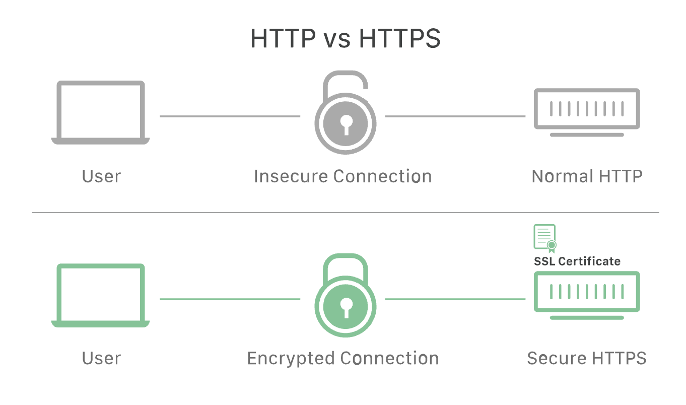
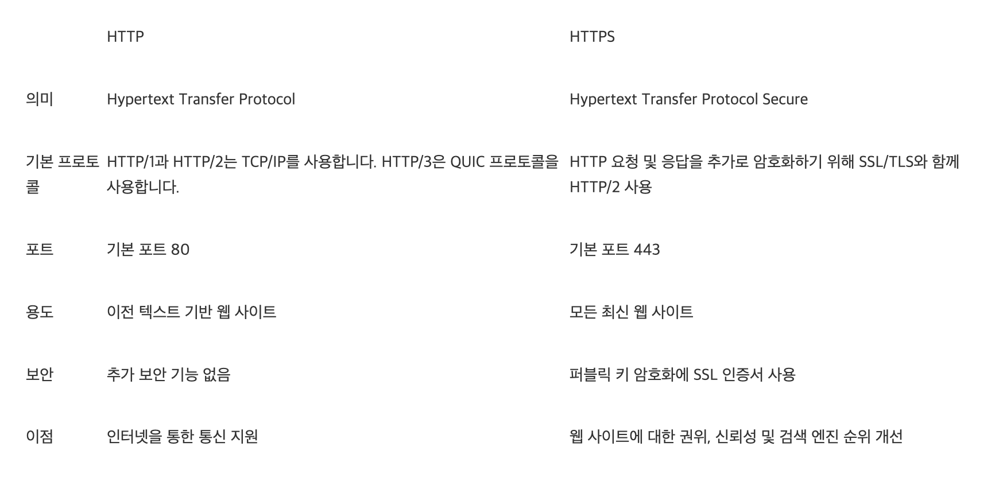

# http에 대해 설명해주세요

HTTP(Hypertext Transfer Protocol)는 **클라이언트와 서버 간 통신을 위한 통신 규칙 세트 혹은 프로토콜**이다.
사용자가 웹사이트를 방문하면 사용자 브라우저가 웹 서버에 http 요청을 전송하고 웹 서버는 http 응답으로 응답한다.
웹 서버와 사용자 브라우저는 데이터를 일반 텍스트로 교환한다.

http 프로토콜은 **네트워크 통신을 작동하게 하는 기본 기술**이다.

## http 프로토콜

http는 **OSI(Open Systems Interconnection) 네트워크 통신 모델의 애플리케이션 계층 프로토콜**이다.

http는 **여러 유형의 요청과 응답을 정의**한다.

브라우저와 웹 서버가 사용하는 통신 방식이므로 World Wide Web은 모든 사용자에게 일관되게 작동한다.

## https 프로토콜

http는 암호화되지 않은 데이터를 전송한다.

HTTPS(Hypertext Transfer Protocol Secure)는 **HTTP의 확장 버전 혹은 더 안전한 버전**이다.
https에서는 브라우저와 서버가 데이터를 전송하기 전에 안전하고 암호화된 연결을 설정한다.
http 요청 및 응답을 `SSL` 및 `TLS` 기술에 결합한다.

https 웹사이트는 독립된 인증 기관(CA)에서 SSL/TLS 인증서를 획득해야 한다.
이러한 웹사이트는 신뢰를 구축하기 위해 데이터를 교환하기 전에 브라우저와 인증서를 공유한다.

ssl 인증서는 암호화 정보도 포함해서 서버와 브라우저는 암호화된 데이터나 스크램블된 데이터를 교환할 수 있다.

과정은 다음과 같다.

1. 사용자 브라우저의 주소 표시줄에 `https:// URL` 형식을 입력하여 HTTPS 웹 사이트를 방문
2. 브라우저는 서버의 SSL 인증서를 요청하여 사이트의 신뢰성을 검증하려고 시도
3. 서버는 퍼블릭 키가 포함된 SSL 인증서를 회신으로 전송
4. 웹 사이트의 SSL 인증서는 서버 아이덴티티를 증명. 브라우저에서 인증되면 브라우저가 퍼블릭 키를 사용하여 비밀 세션 키가 포함된 메시지를 암호화하고 전송
5. 웹 서버는 개인 키를 사용하여 메시지를 해독하고 세션 키를 검색. 그 다음 세션 키를 암호화하고 브라우저에 승인 메시지를 전송
6. 이제 브라우저와 웹 서버 모두 동일한 세션 키를 사용하여 메시지를 안전하게 교환하도록 전환

### SSL

SSL(Secure Sockets Layer)는 **암호화 기반 인터넷 보안 프로토콜**이다.
SSL은 TLS(Transport Layer Security)로 발전한다.

### TSL

TLS는 **인터넷 커뮤니케이션을 위한 개인 정보와 데이터 무결성을 제공하는 보안 프로토콜**이다.

TLS 버전 1.0은 SSL 버전 3.1로서 개발을 시작했지만 Netscape와 더 이상 연관이 없음을 명시하기 위해 발표 전에 프로토콜의 이름이 변경되었다.

### TLS와 SSL의 역할

원래 웹 상의 데이터는 메시지를 가로채면 누구나 읽을 수 있는 일반 텍스트 형태로 전송되었다.
가령 고객이 쇼핑 웹사이트를 방문하여 주문하고, 신용 카드 번호를 입력했다고 하면, 해당 신용 카드 번호가 숨겨지지 않은 채 인터넷을 이동하게 된다.

SSL은 이를 해결하고자 **사용자 개인 정보를 보호**하기 위해 제작되었다.
SSL은 사용자와 웹 서버 사이를 이동하는 모든 데이터를 암호화하여, 누군가 데이터를 가로채더라도 무작위 문자만 볼 수 있다.

SSL은 **특정한 유형의 사이버 공격도 차단**한다.
공격자들이 사용자를 속여 데이터를 훔치기 위한 가짜 웹사이트를 만들거나 전송 중인 데이터를 조작할 수 있어 SSL은 웹 서버를 인증하도록 한다.

## HTTP/2, HTTP/3, HTTPS의 차이점

1996 ~ 1997년에 출시된 최초의 HTTP 버전이 `HTTP/1.1`이다.
`HTTP/2`와 `HTTP/3`은 **프로토콜 자체를 업그레이드한 버전**이다.
데이터 전송 시스템을 수정하면서 효율성을 개선했다.

`HTTP/2`는 텍스트 형식 대신 **바이너리로 데이터를 교환**한다.
또한, 서버가 새 HTTP 요청을 기다리는 대신 **클라이언트 캐시에 응답을 사전에 전송**할 수 있다.

`HTTP/3`은 `HTTP/2`를 더 발전시킨 것이다.
`HTTP/3`의 목표는 **실시간 스트리밍 및 기타 최신 데이터 전송 요구 사항을 효율적으로 지원**하는 것이다.

## GPT로 문장 정리하기

> http에 대해 설명해줘

- 클라이언트와 서버 간 통신을 위한 통신 규칙
- 브라우저와 웹 서버 간의 통신에 사용
- 주요 특징과 동작
  - 클라이언트-서버 모델
    - 클라이언트와 서버 간의 요청(Request) 및 응답(Response)을 기반으로 하는 클라이언트-서버 모델
  - 무상태(stateless) 프로토콜
    - 각각의 요청은 서로 독립적이며 이전 요청이나 응답과 무관
    - 서버는 각 요청을 독립적으로 처리하고 상태 정보를 유지하지 않음
  - 텍스트 기반 프로토콜
    - HTTP 메시지는 텍스트 형식으로 구성, 이해하기 쉽고 디버깅이 용이
  - URL(Uniform Resource Locator)
    - 리소스(문서, 이미지 등)를 식별하는 데 사용되는 특정한 형식의 주소
  - 메서드
  - 상태 코드
  - 헤더

## 키워드 정리

- 클라이언트와 서버 간 통신을 위한 통신 규칙 세트 혹은 프로토콜
- http/https
- SSL/TLS

## 참고 자료

- [HTTP와 HTTPS의 차이점은 무엇인가요?](https://aws.amazon.com/ko/compare/the-difference-between-https-and-http/)
- [HTTP가 안전하지 않은 이유는? | HTTP와 HTTPS의 비교](https://www.cloudflare.com/ko-kr/learning/ssl/why-is-http-not-secure/)
- [SSL이란 무엇입니까? | SSL 정의](https://www.cloudflare.com/ko-kr/learning/ssl/what-is-ssl/)
- [TLS(Transport Layer Security)는 무엇입니까?](https://www.cloudflare.com/ko-kr/learning/ssl/transport-layer-security-tls/)
