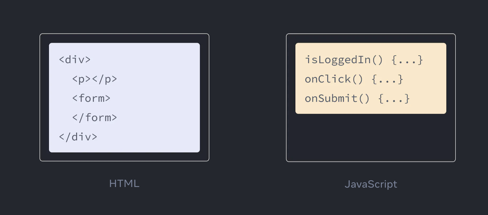
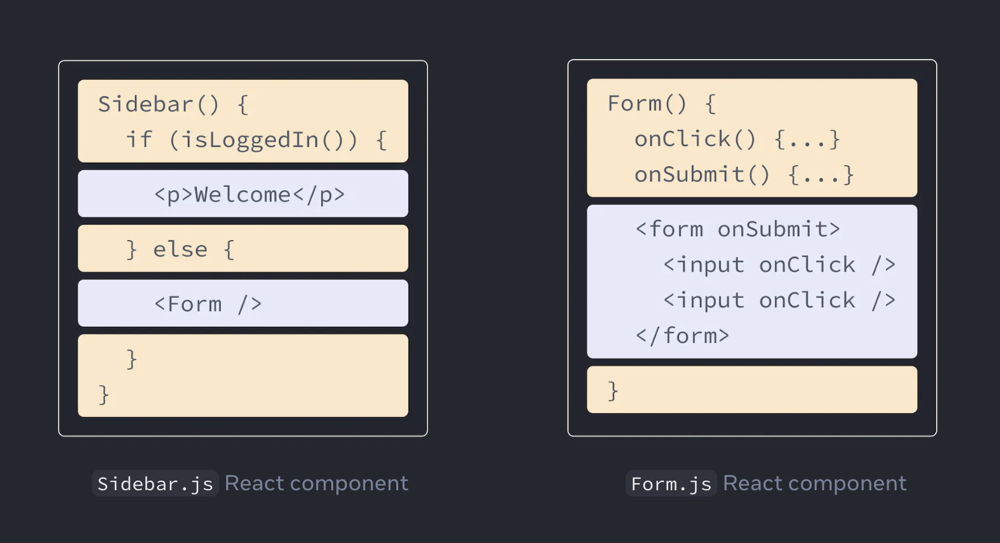

# JSX에 대해 설명해주세요

`JSX`는 **자바스크립트 파일 내 HTML과 유사한 마크업을 작성할 수 있는 자바스크립트용 구문 확장자**이다.

**렌더링 로직과 컨텐츠를 같은 위치에 유지**할 수 있도록 해준다.

`JSX`의 간결함으로 대부분의 경우 `JSX`를 사용한다.

`JSX`는 JavaScript XML을 의미한다.

웹 브라우저는 `JSX`를 이해할 수 없다.
보통 `Babel` 컴파일러를 사용하여 HTML처럼 보이는 것을 JavaScript 함수 호출로 변환하여 브라우저가 이해할 수 있게 변환한다.

## JSX: 자바스크립트에 마크업 넣기

웹은 HTML, CSS, JavaScript로 구성된다.
오랜 기간 서로 분리된 파일에서 작업이 이루어졌다.

- HTML: 콘텐츠
- CSS: 디자인
- JavaScript: 로직

하지만 웹은 점점 인터랙티브하고 로직이 컨텐츠를 결정하는 경우가 많아졌다.
이에 JavaScript가 HTML을 담당하게 되었다.

이것이 React에서 렌더링 로직과 마크업이 같은 위치에 존재하는 이유이다.

`JSX`는 HTML과 비슷해 보이지만 조금 더 엄격하고 동적 정보를 표시할 수 있다.

### JSX와 React는 다르다

> JSX and React are two separate things. They’re often used together, but you can use them independently of each other. JSX is a syntax extension, while React is a JavaScript library.

`JSX`는 **React와 별개의 개념**이다.
보통 함께 사용되지만 서로 독립적으로도 사용할 수 있다.

`JSX`는 **구문 확장**인 반면 Raect는 JavaScript 라이브러리이다.

## JSX 규칙

### 하나의 root element 반환

컴포넌트에서 여러 `element`를 반환하려면 하나의 부모 태그로 래핑해야 한다.

`JSX`는 HTML처럼 보이지만 내부에서는 일반 JavaScript 객체로 변환된다.
함수에서 두 개의 객체를 배열로 래핑하지 않고는 반환할 수 없다.

### 모든 태그 닫기

`JSX`에서는 태그가 명시적으로 닫혀 있어야 한다.

### 대부분의 경우 camelCase

`JSX`는 JavaScript로 변환되고 `JSX`에 쓰여진 속성들은 JavaScript 객체의 키가 된다.
JavaScript에는 변수 이름에 제한이 있다.
예를 들어 변수 이름에 대시를 포함하거나 클래스같은 에약어를 사용할 수 없다.

## GPT로 문장 정리하기

> JSX에 대해 설명해줘

- React에서 사용되는 JavaScript 확장 문법
- 주요 특징과 사용법
  - XML과 유사한 구조
    - HTML과 유사한 구조, XML 형식으로 태그 사용
  - JavaScript 표현식 사용
    - JSX 내에서 중괄호({})를 사용하여 JavaScript 표현식 삽입
  - 컴포넌트 작성
  - Babel 변환
    - JSX 코드는 브라우저에서 직접 실행되지 않음
    - Babel과 컴파일러를 사용하여 일반적인 JavaScript 코드로 변환
- React 코드를 더 가독성있고 유지보수하기 편하게 작성

## 키워드 정리

- JavaScript XML

## 참고 자료

- [Writing Markup with JSX](https://react.dev/learn/writing-markup-with-jsx)
