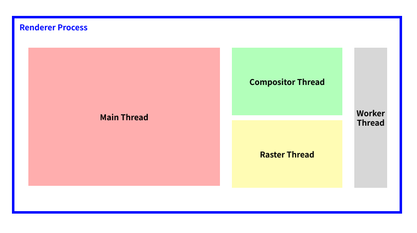
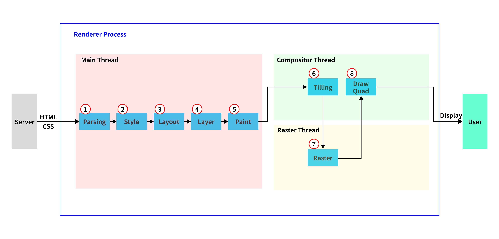

# 브라우저 렌더링에 대해 설명해주세요

- HTML 파싱, **DOM(Document Object Model) 트리를 구축**한다.
- CSS 파싱, **CSSOM(CSS Object Model) 트리를 구축**한다.
- DOM과 CSSOM을 조합하여 **렌더트리(Render Tree)를 구축**한다.
- **JavaScript를 실행**, HTML 중간에 스크립트가 있다면 HTML 파싱을 중단한다.
- 뷰포트 기반으로 렌더트리의 각 노드가 가지는 정확한 위치와 크기를 계산한다.
  - 여기서 **Layout과 Reflow 단계**를 거친다.
- 계산된 위치와 크기를 기반으로 화면에 그리는 **Paint 단계**를 진행한다.

## 브라우저

HTML, 문서, 이미지, 폰트 등의 사용자가 선택한 자원을 전송 및 표현하는 소프트웨어이다.

사용자가 갖고자 하는 자원을 서버로 요청하고 응답받은 자원을 브라우저에 알맞게 표시하는 행위이다.

## 브라우저 기본 구조

### 사용자 인터페이스

사용자가 요청한 페이지(웹페이지)를 제외한 모든 부분을 지칭한다.

### 브라우저 엔진

동작을 제어하는 엔진이다.

유저 인터페이스와 렌더링 엔진을 연결한다.

### 렌더링 엔진

요청받은 내용(HTML, CSS 파싱)을 브라우저에 표시한다.

업데이트가 필요할 때 효율적으로 렌더링을 할 수 있도록 자료 구조를 생성한다.

이는 웹 브라우저마다 다르다.

- Safafi: Webkit
- Firefox: Gecko
- Chrome: Blink

### 통신

각종 네트워크 요청을 수행한다.

### JS 해석기

JS 코드를 실행한다.

### UI 백엔드

기본적인 위젯을 그린다.

### 자료 저장소

보조기억장치에 데이터를 저장한다.

## Renderer Process

## Main Thread

**1. 파싱**

HTML 코드를 DOM Tree로 만든다.

**2. Style**

가지고 있는 DOM Tree로 계산된 스타일(Computed Style)을 도출해낸다.

**3. Layout**

x, y 좌표와 요소의 크기에 대한 정보를 계산한 Layout Tree를 생성한다.

**4. Layer**

그리는 순서를 정한다.

페이지에 출력될 노드들의 크기와 위치, 레이어끼리의 순서 정보를 계산한다.

레이어는 z축을 활용하는 3차원 개념으로 렌더링 과정에 삽입, 쌓임 맥락이 적용된다.

**5. Paint**

배치된 요소들에게 색을 입히고 레이어의 위치를 결정한다.

z-index가 낮은 순서대로 페인팅이 진행된다.

### 용어 정리

**Render Tree**

- DOM Tree와 CSSOM 트리를 합친 것이다.
  - DOM(Document Object Model): HTML 요소들의 구조화된 표현
  - CSSOM(Cascading Style Sheets Object Model): 요소들과 연관된 스타일 정보의 구조화된 표현
- 화면에 표시되어야 할 모든 노드의 콘텐츠와 스타일 정보를 포함한 트리이다.

**Reflow**

- Layout과 Paint 단계를 재실행한다.
- ex) left

**Repaint**

- Paint 단계만 재실행한다.
- ex) transform

### UI가 업데이트되는 3가지 상황

#### Layout이 다시 발생하는 경우

- 요소의 크기나 위치가 바뀔 때, 브라우저 창의 크기가 바뀌었을 때 다시 발생
- JavaScript → Style → Layout → Paint → Composite

#### Paint부터 다시 발생하는 경우

- 배경 이미지나 텍스트 색상, 그림자 등 레이아웃의 수치를 변화시키지 않는 스타일의 변경이 일어났을 때 발생
- JavaScript → Style → Paint → Composite

#### 레이어의 합성만 다시 발생하는 경우

- Layout과 Paint를 수행하지 않고 레이어의 합성만 발생하기 때문에 성능상으로 가장 큰 이점을 가짐
- JavaScript → Style → Composite

## Other Thread

### Tiling

- `Compositor Thread`에 해당된다.
- `Paint Records`로 `Tile`을 만드는 단계이다.
- 한 번에 전체를 렌더링하는 것이 아닌 필요한 부분만 우선적으로 렌더링하기 위해 나누는 것이다.

### Raster

- 화면을 픽셀로 변환하는 작업이다.
- `Tile`들을 가지고 실제 화면에 보여질 비트맵을 만들어주는 과정이다.
- `Tile`마다 각각의 `Raster Thread`에서 진행된다.

### Draw Quad

- `Compositor Thread`에 해당된다.
- `Raster`된 비트맵들을 다시 합성해주는 과정이다.
- `Raster`가 완료된 비트맵들을 이용해 `Compositor Frame`을 만든다.

## GPT로 문장 정리하기

> 브라우저 렌더링에 대해 설명해줘

- 웹페이지를 화면에 표시하기 위한 과정
- 브라우저는 HTML, CSS, JavaScript 등의 웹페이지 자원을 다운로드하고 해석하여 화면에 페인트

## 키워드 정리

- 렌더링 엔진
- DOM Tree
- CSSOM Tree
- Render Tree

## 참고 자료

- [Critical rendering path](https://developer.mozilla.org/en-US/docs/Web/Performance/Critical_rendering_path)
- [최신 브라우저의 내부 살펴보기 3 - 렌더러 프로세스의 내부 동작](https://d2.naver.com/helloworld/5237120)
- [렌더링 트리 생성, 레이아웃 및 페인트](https://web.dev/articles/critical-rendering-path/render-tree-construction?hl=ko)
